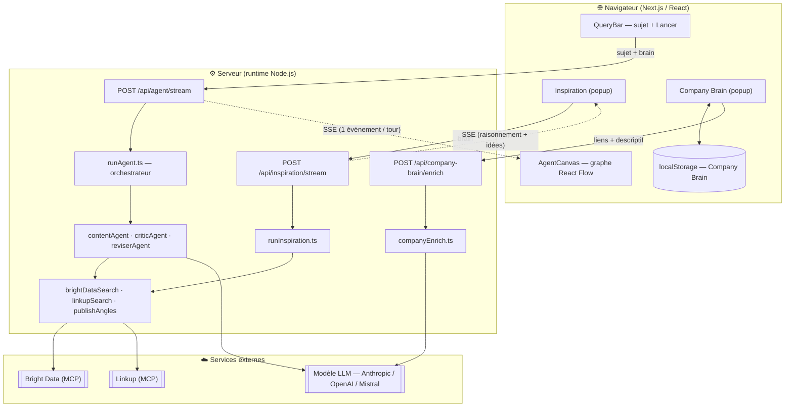
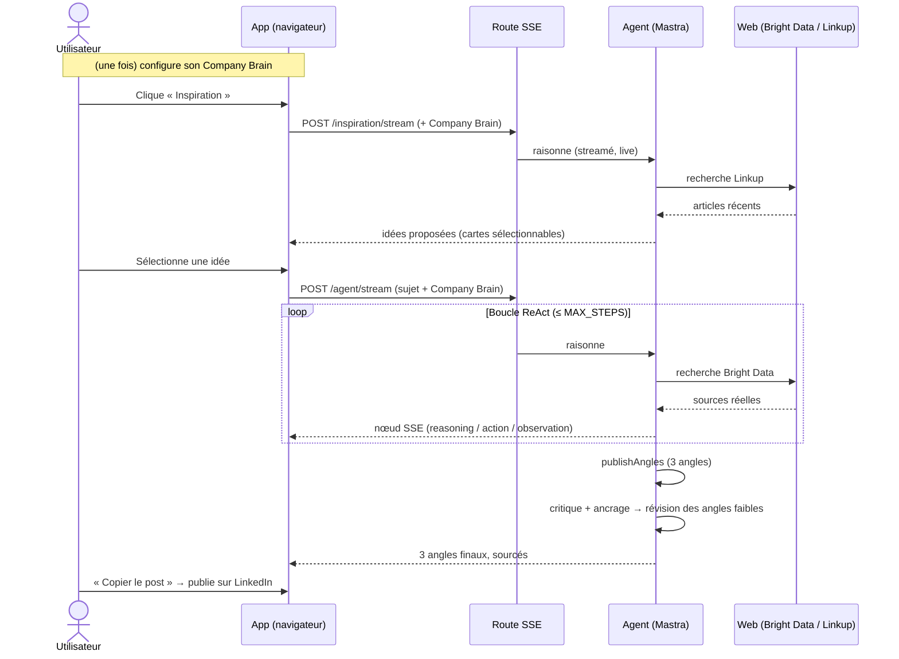
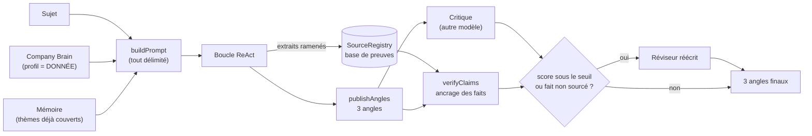

<div align="center">

# 🛫 BrandPilot

**Votre copilote de contenu LinkedIn.** Un vrai agent IA qui vous connaît,
réfléchit **en direct**, cherche le web réel, et vous livre **3 angles de post
sourcés** — prêts à publier, écrits dans **votre voix**.

   

</div>

> **Beaucoup de gens ont des idées. Peu osent les publier** — faute de temps ou
> d'inspiration. BrandPilot supprime les deux frictions : il part de **qui vous
> êtes**, propose des idées ancrées dans l'actualité, puis rédige des angles
> différenciés et **sourcés**. Vous choisissez, vous publiez. On vous lit enfin.

---

## Sommaire

- [Ce que c'est](#ce-que-cest)
- [Surfaces](#surfaces)
- [The loop](#the-loop)
- [North Star](#north-star)
- [Architecture](#architecture)
  - [System overview](#system-overview)
  - [User flow](#user-flow)
  - [Data flow](#data-flow)
- [Les règles non-négociables](#les-règles-non-négociables)
- [Tech stack](#tech-stack)
- [Setup](#setup)
- [Structure des fichiers](#structure-des-fichiers)
- [Deploy](#deploy)
- [Sécurité](#sécurité)

---

## Ce que c'est

BrandPilot prend un **sujet** (ou vous en propose un) et un **vrai agent IA**
raisonne, va chercher des informations sur le web, puis en tire **3 angles de
post LinkedIn** prêts à publier. Pendant qu'il travaille, on voit son
raisonnement se construire **en direct**, sous forme d'un **graphe de nœuds
animé**.

Ce n'est pas un pipeline scripté. L'agent suit une **boucle ReAct** (*Reason →
Act → Observe*) et décide **lui-même** quand chercher, quand reboucler et quand
s'arrêter. Le runtime **Mastra** exécute cette boucle.

**Décision d'architecture centrale :** l'agent **finit en appelant un outil**
(`publishAngles`) plutôt qu'en produisant du texte libre. Sortie structurée
garantie, et un point naturel pour émettre les nœuds finaux du graphe.

> 🎯 **Marche sans aucune clé payante.** Sans clé, un agent de démonstration
> simule la boucle et la recherche renvoie des résultats réalistes. Ajoutez des
> clés pour passer au réel — **sans changer une ligne de code**.

---

## Surfaces

Les façons de s'en servir — toutes passent par le même graphe live et le même
contrat d'événements.

| Surface | Ce que c'est | État |
| --- | --- | --- |
| ▶ **Lancer sur un sujet** | Vous tapez un sujet → 3 angles sourcés | ✅ |
| 💡 **Inspiration** | L'agent propose des idées à partir de qui vous êtes (**Linkup** + Company Brain), en réfléchissant en direct ; vous en choisissez une → lance l'agent | ✅ |
| 🧠 **Company Brain** | Votre identité (LinkedIn, site, descriptif) → profil auteur enrichi (**Bright Data** + LLM), injecté dans **chaque** post | ✅ |
| 🌐 **App web (graphe live)** | `localhost:3000` — raisonnement animé, timeline, 3 angles copiables | ✅ |
| 🎨 **Landing page** | Page de présentation du produit (artifact HTML autonome) | ✅ |

---

## The loop

« ReAct » = **Reason + Act**. Le modèle travaille par petites étapes, en boucle,
et **décide lui-même** de la suite :

```
        ┌─────────────────────────────────────────────┐
        │                                             ▼
   1. RAISONNE   →   2. AGIT (cherche)   →   3. OBSERVE (résultats)
   « que me      │   « je lance une       │   « voici 4 sources, »
     manque-t-il?»│     recherche web »    │     que m'apprennent-elles?»
        ▲         └────────────────────────┘            │
        │   « il me manque un angle, je recommence »     │
        └────────────────────────────────────────────────┘
                              │  (quand l'agent a assez de matière)
                              ▼
                    4. PUBLIE 3 ANGLES  →  critique → ancrage → révision → fin
```

- Raisonnement (nœud violet) → recherche (nœud bleu) → observation (nœud gris),
  puis reboucle si besoin — l'arête orange **« ↺ re-recherche »** rend la boucle
  visible à l'écran.
- Une **limite dure** (`MAX_STEPS`, 6 par défaut) empêche toute boucle infinie.
- L'agent termine par **3 angles** (nœuds roses), chacun adossé à au moins une
  **source réelle**, puis relus par un **critique** et **ancrés** fait par fait.

---

## North Star

> **North Star Metric —** `posts_publies_depuis_brandpilot_par_semaine`
> Le nombre de posts LinkedIn **réellement publiés** par l'utilisateur à partir
> d'un angle produit par BrandPilot, par semaine.

On ne gagne pas quand un angle est *généré* (vanité) — on gagne quand un post
est **publié**. Toute la boucle produit/qualité pointe vers ça.

**Ce qui compte (éligibilité)**

| Compte ✅ | Ne compte pas ❌ |
| --- | --- |
| Un angle copié **et** publié sur LinkedIn | Un angle généré mais jamais publié |
| Publié dans la voix de l'utilisateur (Company Brain actif) | Un brouillon abandonné |
| Issu d'un sujet direct **ou** d'une idée Inspiration | Un simple aperçu sans action |

**Indicateurs avancés (leading) & de résultat (lagging)**

| Type | Indicateur | Pourquoi il compte |
| --- | --- | --- |
| Leading | Company Brain configuré | Des posts plus personnels → plus publiés |
| Leading | Taux de sélection d'une idée Inspiration | Débloque directement la page blanche |
| Leading | Angles générés par session | La matière première |
| Lagging | **Posts publiés / semaine** (NSM) | La valeur réelle créée |
| Lagging | Engagement des posts publiés | Preuve que la qualité tient |

**Garde-fous** (notés par niveau d'application, honnêtement)

| Garde-fou | Mécanisme | Niveau |
| --- | --- | --- |
| Chaque affirmation factuelle adossée à une source réelle | `verifyClaims.ts` confronte aux extraits ramenés | **HARD** |
| Aucune citation ni chiffre inventé | Fact-check → révision automatique | **HARD** |
| Le contenu des outils = donnée, jamais instruction | Délimitation dans le prompt | **HARD** |
| Aucun secret dans le code | `process.env` uniquement + `.gitignore` | **HARD** |
| Écrit dans la voix de l'auteur | Company Brain + few-shot voix | **SOFT** *(pas encore mesuré automatiquement)* |
| Non-répétition entre runs | Rappel mémoire des thèmes déjà couverts | **SOFT** |
| Mesure réelle des posts publiés (analytics) | — | **BACKLOG** *(pas d'intégration LinkedIn à ce jour)* |

---

## Architecture

### System overview



### User flow



### Data flow



Chaque étape émet un **événement SSE typé et validé (Zod)** — le même contrat des
deux côtés (`src/mastra/lib/schemas.ts`), donc serveur et interface ne peuvent
jamais se désynchroniser.

---

## Les règles non-négociables

1. **On finit avec un outil.** L'agent appelle `publishAngles` — sortie
   structurée garantie, jamais de parsing de texte libre.
2. **La topologie du graphe est décidée côté serveur** (`events.ts`). L'interface
   reste « bête » : elle dessine ce qu'on lui dit. La boucle est donc fiable.
3. **Le contenu ramené par les outils est une DONNÉE, jamais des instructions**
   (délimité dans le prompt) — première défense contre l'injection de prompt. La
   Company Brain est injectée sous cette même règle.
4. **Ça marche sans aucune clé.** Pas de clé → agent démo + recherche mock, même
   rendu visuel. Une clé « upgrade » vers le réel sans changement de code.
5. **Aucun secret dans le code.** Lecture via `process.env` uniquement ;
   `.env.local` (local) ou secret d'hôte (prod).
6. **Chaque fait est sourcé — ou signalé.** Jamais inventé.

---

## Tech stack

| Couche | Technologie |
| --- | --- |
| Framework | **Next.js 14** (App Router), **TypeScript strict**, Node 20 |
| Agent | **Mastra** (`@mastra/core`, `@mastra/mcp`) — runtime de la boucle ReAct |
| Modèles | **Vercel AI SDK v4** + `@ai-sdk/anthropic` / `openai` / `mistral`, routés par `MODEL_PROVIDER` |
| Recherche web | **Bright Data** (MCP) pour le rédacteur · **Linkup** (MCP) pour l'Inspiration — mock si pas de clé |
| Graphe | **React Flow** (`@xyflow/react`) + **dagre** (auto-layout gauche→droite) |
| UI | **Tailwind CSS** + **shadcn/ui** (Radix) · **Framer Motion** · **Sonner** · **Lucide** · **next-themes** |
| Contrat de données | **Zod** — validé côté serveur **et** navigateur |
| Streaming | **SSE** (Server-Sent Events), runtime **Node.js** (Mastra + MCP ont besoin des API Node) |
| Persistance | **localStorage** (Company Brain) · fichier JSON (mémoire non-répétition) |

---

## Setup

Prérequis : **Node.js 20+**.

```bash
# 1. Installer les dépendances
npm install

# 2. (Optionnel) configurer l'environnement
cp .env.example .env.local
#   — laissez tout vide pour la démo sans clé
#   — ou renseignez une clé de modèle (+ MODEL_PROVIDER) pour le vrai agent
#   — BRIGHT_DATA_API_TOKEN → vraie recherche web (rédacteur + Company Brain)
#   — LINKUP_API_KEY        → vraie recherche pour l'Inspiration

# 3. Lancer
npm run dev
```

Ouvrez **http://localhost:3000**. Tapez un sujet (ou cliquez **Inspiration**),
lancez l'agent : le graphe se construit nœud par nœud, la boucle de re-recherche
est visible, puis **3 angles** s'affichent — copiables en un clic.

**Scripts**

```bash
npm run dev        # développement (http://localhost:3000)
npm run build      # build de production
npm run start      # serveur de production
npm run lint       # ESLint
npm run typecheck  # vérification des types
npm run evals      # évaluations hors ligne (cassettes figées) → evals/report.json
```

**Variables d'environnement** (détail dans [`.env.example`](./.env.example) et [`CLAUDE.md`](./CLAUDE.md))

| Variable | Rôle | Défaut |
| --- | --- | --- |
| `MODEL_PROVIDER` | Modèle de l'agent, format `fournisseur/modèle` | `anthropic/claude-opus-4-8` |
| `ANTHROPIC_API_KEY` / `OPENAI_API_KEY` / `MISTRAL_API_KEY` | Clé du provider choisi | — |
| `BRIGHT_DATA_API_TOKEN` | Vraie recherche web + enrichissement Company Brain | — (mock) |
| `LINKUP_API_KEY` | Vraie recherche pour l'Inspiration | — (mock) |
| `MAX_STEPS` | Garde-fou : nombre max de tours de boucle | `6` |
| `CRITIC_MODEL_PROVIDER` | Modèle du critique (regard indépendant) | Anthropic ≠ rédacteur |
| `REVISE_THRESHOLD` | Note /100 sous laquelle un angle est réécrit | `75` |
| `MEMORY_PATH` | Fichier mémoire (non-répétition entre runs) | `.mastra/memory.json` |

---

## Structure des fichiers

```
src/
├─ mastra/                         ← tout ce qui concerne les AGENTS
│  ├─ agents/
│  │  ├─ contentAgent.ts           ← le RÉDACTEUR : instructions + voix, modèle, outils
│  │  ├─ criticAgent.ts            ← le CRITIQUE : note les 3 angles (modèle différent)
│  │  └─ reviserAgent.ts           ← le RÉVISEUR : réécrit un angle faible ou non sourcé
│  ├─ tools/
│  │  ├─ brightDataSearch.ts       ← recherche web + scrape d'URL (Bright Data MCP) OU mock
│  │  ├─ linkupSearch.ts           ← recherche web via Linkup MCP (Inspiration) OU mock
│  │  └─ publishAngles.ts          ← outil « j'ai fini » : livre 3 angles structurés
│  ├─ voice/                       ← few-shot : voix de l'auteur ≠ structure
│  ├─ memory/                      ← non-répétition entre runs
│  └─ lib/
│     ├─ schemas.ts                ← contrat de données partagé (Zod)
│     ├─ models.ts                 ← routing modèle (MODEL_PROVIDER / CRITIC_MODEL_PROVIDER)
│     ├─ events.ts                 ← vie de l'agent → nœuds/arêtes (topologie)
│     ├─ runAgent.ts               ← orchestre : rédacteur → critique + ancrage → révision
│     ├─ runInspiration.ts         ← Inspiration : raisonne → cherche (Linkup) → idées
│     ├─ companyEnrich.ts          ← Company Brain : scrape + distille un profil auteur (LLM)
│     ├─ verifyClaims.ts           ← ancrage : chaque fait confronté à une source réelle
│     └─ mockAgent.ts              ← agent de démonstration (boucle simulée, sans clé)
│
├─ app/
│  ├─ page.tsx                     ← écran principal : barre + canvas + résultats + dialogs
│  ├─ api/agent/stream/            ← SSE : la boucle ReAct du rédacteur
│  ├─ api/inspiration/stream/      ← SSE : raisonnement live + idées
│  └─ api/company-brain/enrich/    ← enrichissement du Company Brain
│
├─ components/
│  ├─ QueryBar.tsx                 ← sujet + Lancer + Inspiration + déclencheur Company Brain
│  ├─ CompanyBrainDialog.tsx       ← popup « qui êtes-vous »
│  ├─ InspirationDialog.tsx        ← popup Inspiration : raisonnement live + cartes d'idées
│  ├─ ResultPanel.tsx              ← les 3 angles finaux (« Copier le post »)
│  └─ graph/                       ← TOUT le graphe React Flow (canvas, nœuds, arêtes, layout)
│
└─ hooks/
   ├─ useAgentStream.ts            ← lit le flux SSE de l'agent (+ envoie la Company Brain)
   ├─ useCompanyBrain.ts           ← persiste la Company Brain (localStorage)
   └─ useInspirationStream.ts      ← lit le flux SSE de l'Inspiration
```

---

## Deploy

**Cible : Vercel** — hôte Node natif pour Next.js. Tout tourne en réel (Mastra,
Bright Data, Linkup, SSE), sans config au-delà des variables d'environnement.
Guide pas-à-pas : [`DEPLOY-VERCEL.md`](./DEPLOY-VERCEL.md).

1. Poussez le dépôt sur GitHub.
2. Sur [vercel.com](https://vercel.com) → **New Project** → importez le dépôt.
3. **Settings → Environment Variables** — ajoutez ce dont vous avez besoin
   (pour une démo, **aucune n'est obligatoire**) :
   - `MODEL_PROVIDER` + la clé du provider (`ANTHROPIC_API_KEY`…)
   - `BRIGHT_DATA_API_TOKEN` (recherche du rédacteur + Company Brain)
   - `LINKUP_API_KEY` (Inspiration)
4. **Deploy.**

[`vercel.json`](./vercel.json) configure déjà les **en-têtes de sécurité** (CSP,
HSTS, X-Frame-Options…) et le **`maxDuration`** des routes SSE (l'agent peut
boucler plusieurs secondes). Les routes tournent sur le **runtime Node.js**
(Mastra + MCP ont besoin des API Node).

> ℹ️ **Pourquoi pas Cloudflare Workers ?** Testé et écarté : la couche MCP de
> Mastra valide ses schémas d'outils via `new Function()` (AJV), interdit par la
> CSP de Workers — **tous les outils MCP y échouent**, quel que soit le
> transport. Ajoutez la limite de taille de bundle et le système de fichiers
> éphémère : Workers n'est pas viable pour cette app aujourd'hui. Cloudflare
> reste parfait **devant** Vercel pour le DNS/CDN. *(Bright Data utilise
> désormais son MCP distant HTTP `mcp.brightdata.com` — aucun sous-process, donc
> robuste sur tout hôte Node / serverless.)*

---

## Sécurité

- **Secrets** lus **uniquement** depuis l'environnement, jamais codés en dur.
  `.env.local`, `.mastra/` et les sorties de build sont gitignorés ; le dépôt
  public est audité avant chaque push.
- **Anti prompt-injection** : le contenu ramené par les outils **et** la Company
  Brain sont traités comme de la **donnée délimitée**, jamais comme des
  instructions.
- **Anti-hallucination** : chaque fait est confronté aux extraits réellement
  ramenés (`verifyClaims.ts`) ; un fait non sourcé déclenche une révision.

---

<div align="center">
<sub>MIT — faites-en bon usage. Construit avec un vrai agent, pas un script. 🛫</sub>
</div>
